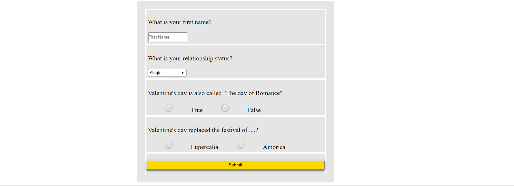

# Love-JaveScript-Challenge
This was actually a challenge lauched by Developers in Vogue, Ghana.
I participated in this challenge and came up with this web app using a vuejs framework.
This is a web app built using vuejs that shows a countdown to valentine's day. 
It also has a form that tests users knowledge on Valentine's day.

# Features 
The web app has a countdown timer that counts down from the current date and time to the specified date and time.


It also has a form where users are asked to input their names and anser a few questions about valentines's day.




# How to run the code
To use vuejs, i used the the cdn for vuejs in the head of the html file.
``` <script src="https://npmcdn.com/vue/dist/vue.js"></script> ```

# Credits
Thanks, Developers in Vogue for the challenge. 
